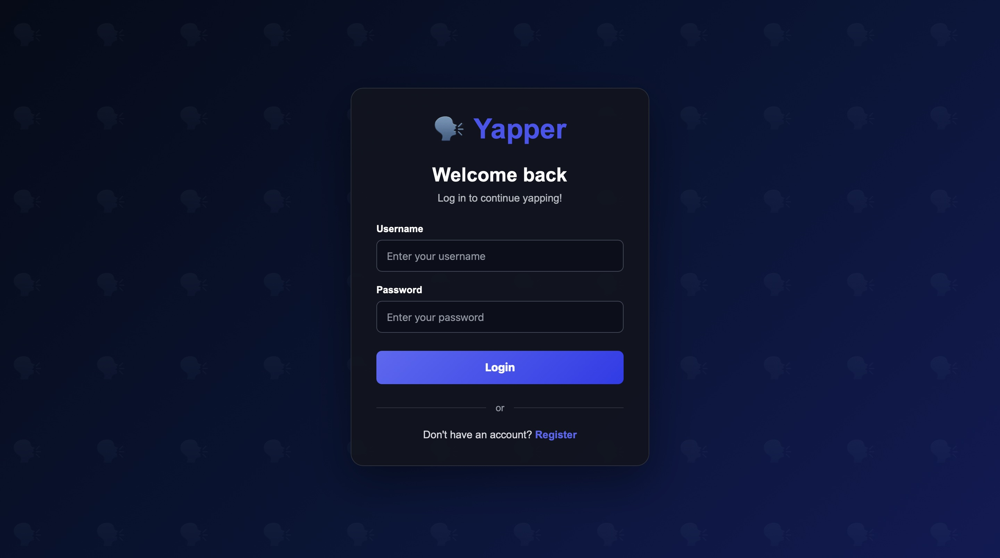
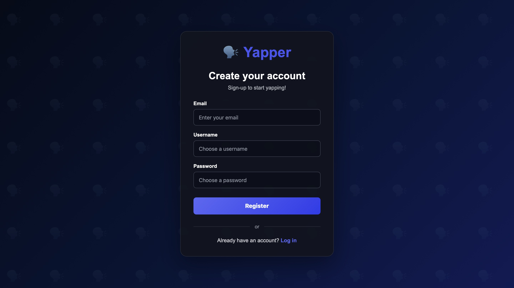
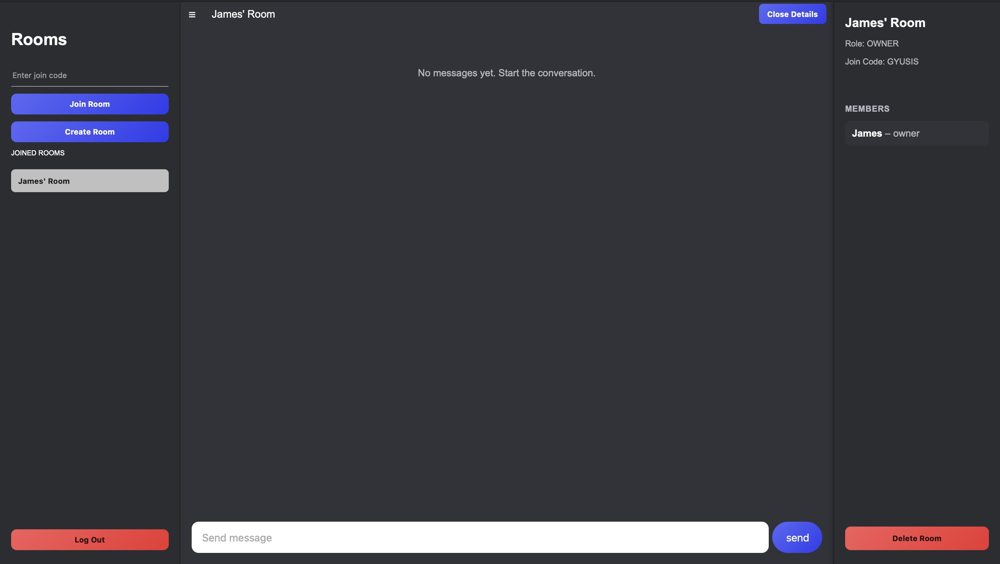
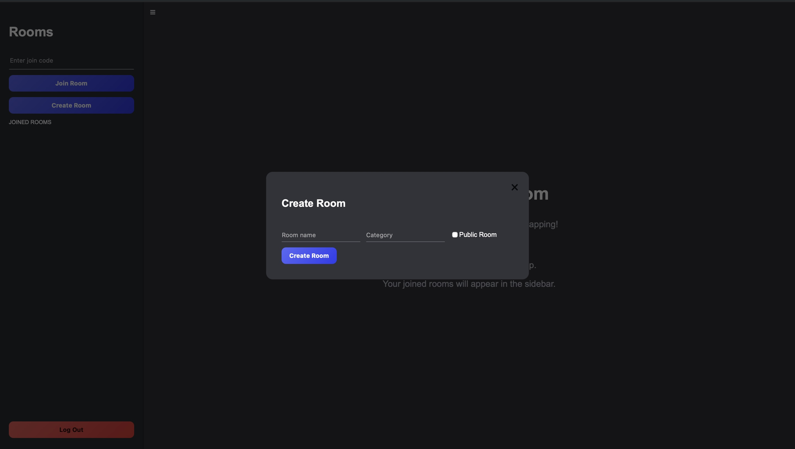

# Yapper

A full-stack real-time chat application built with Spring Boot, React, PostgreSQL, JWT authentication, and STOMP/WebSockets.

Users can register, log in, create rooms, join rooms by code, send real-time messages, and manage room membership based on their role. Room owners can view members, kick members, and delete rooms, while regular members can leave rooms and participate in chats they belong to.

## Screenshots

### Authentication

| Login | Register |
|-------|----------|
|  |  |

### Chat Dashboard



### Room Creation



## Features

### Authentication

* User registration and login
* BCrypt password hashing
* JWT generation and validation
* Protected REST endpoints
* Authenticated STOMP WebSocket connections
* Protected frontend chat route
* Logout functionality
* Per-tab auth sessions using `sessionStorage`

### Messaging

* Real-time messaging with STOMP and SockJS
* Room-based WebSocket subscriptions
* PostgreSQL message persistence
* Protected message history loading
* Protected WebSocket message sending
* Backend-controlled sender identity
* Message timestamps
* Message date dividers
* Separate styling for the authenticated user's messages

### Rooms

* PostgreSQL-backed room records
* Generated six-character join codes
* Join rooms by code
* Create rooms through the frontend
* Internal numeric room IDs
* User-facing room names
* Public or private room setting
* Optional room categories
* Room switching
* Persistent user-room memberships
* Joined-room sidebar
* Collapsible sidebar
* Room details sidebar
* Room member list
* Owner/member roles
* Owner-only room deletion
* Owner-only member kicking
* Member room leaving

## Tech Stack

### Backend

* Java 17
* Spring Boot
* Spring Security
* Spring Web MVC
* Spring WebSocket
* STOMP
* SockJS
* Spring Data JPA
* PostgreSQL
* JJWT
* BCrypt
* Lombok
* Maven

### Frontend

* React
* Vite
* JavaScript
* React Router
* Axios
* STOMP.js
* SockJS
* CSS

## Repository Structure

```text
yapper/
├── backend/
│   ├── src/
│   ├── pom.xml
│   ├── mvnw
│   ├── mvnw.cmd
│   └── README.md
│
├── frontend/
│   ├── src/
│   ├── package.json
│   ├── package-lock.json
│   ├── vite.config.js
│   └── README.md
│
└── README.md
```

The backend and frontend each include their own README with more detailed documentation.

## Application Flow

### Registration

Users register with an email, username, and password.

The backend:

1. Checks whether the username already exists.
2. Checks whether the email already exists.
3. Hashes the password with BCrypt.
4. Stores the user in PostgreSQL.

Example request:

```json
{
  "email": "user@example.com",
  "username": "user",
  "password": "password"
}
```

### Login

Users log in with a username and password.

The backend:

1. Finds the user by username.
2. Verifies the submitted password with BCrypt.
3. Generates a JWT.
4. Returns the token to the frontend.

Example request:

```json
{
  "username": "user",
  "password": "password"
}
```

The frontend stores the JWT and username in `sessionStorage`:

```javascript
sessionStorage.setItem("jwt_token", token);
sessionStorage.setItem("username", username);
```

The token is included in authenticated REST requests:

```http
Authorization: Bearer <token>
```

Using `sessionStorage` allows different browser tabs to be logged in as different users during development, which makes testing owner/member behavior easier.

## Room Flow

Rooms use two identifiers:

* `id`: internal numeric database ID
* `joinCode`: user-facing code used to find and join a room

Example joined-room response:

```json
{
  "id": 1,
  "name": "Weekend Group",
  "joinCode": "NF5V9H",
  "publicRoom": false,
  "category": "",
  "role": "OWNER"
}
```

### Creating a Room

The room creation flow is:

```text
User creates a room
        ↓
Frontend sends POST /api/rooms
        ↓
Backend creates the room
        ↓
Backend creates an OWNER membership
        ↓
Frontend adds and selects the room
        ↓
Room join code can be copied and shared
```

### Joining a Room

The room joining flow is:

```text
User enters a join code
        ↓
Frontend sends POST /api/rooms/code/{joinCode}
        ↓
Backend creates a MEMBER membership
        ↓
Frontend adds and selects the room
        ↓
Stored message history is loaded
        ↓
Frontend subscribes to the room's WebSocket topic
```

The room name and join code are displayed to the user. The numeric room ID is used internally for database operations, message history, and WebSocket subscriptions.

## Room Roles

Yapper uses room memberships to determine what each user can do inside a room.

### OWNER

Owners can:

* Send and receive messages
* View room members
* Kick members
* Delete the room

### MEMBER

Members can:

* Send and receive messages
* View room members
* Leave the room

Members cannot kick other users or delete rooms.

The frontend displays role-based controls, but the backend still enforces all room permissions.

## WebSocket Flow

The frontend connects to the backend WebSocket endpoint:

```text
/ws
```

The JWT is sent in the STOMP `CONNECT` headers:

```javascript
stompClient.connect(
  {
    Authorization: `Bearer ${token}`
  },
  onConnect,
  onError
);
```

The backend WebSocket interceptor:

1. Intercepts the STOMP `CONNECT` frame.
2. Extracts the JWT.
3. Validates the token.
4. Loads the authenticated user.
5. Attaches the user to the WebSocket session as the principal.

Messages are sent to:

```text
/app/yapper.send
```

Clients subscribe to:

```text
/topic/room/{roomId}
```

Example outgoing message payload:

```json
{
  "roomId": 1,
  "content": "Hello"
}
```

The frontend does not provide the sender name. The backend determines the sender from the authenticated WebSocket principal.

Before saving and broadcasting a message, the backend checks that the authenticated user belongs to the room.

## REST API

### Authentication

#### Register a user

```http
POST /api/auth/register
```

Registers a new user with an email, username, and password.

#### Log in

```http
POST /api/auth/login
```

Authenticates a user and returns a JWT.

### Messages

#### Get message history

```http
GET /api/messages/{roomId}
```

Returns stored messages for a room only if the authenticated user is a member of that room.

#### Save a message through REST

```http
POST /api/messages
```

Saves a message through the REST API only if the authenticated user is a member of that room. Messages are normally sent through WebSocket.

#### Verify authentication

```http
GET /api/messages/test
```

Returns the authenticated username and can be used to verify a JWT.

### Rooms

#### Create a room

```http
POST /api/rooms
```

Example request:

```json
{
  "name": "Weekend Group",
  "publicRoom": false,
  "category": ""
}
```

The backend creates the room, generates a unique six-character join code, and creates an OWNER membership for the authenticated user.

#### Get joined rooms

```http
GET /api/rooms/joined
```

Returns the authenticated user's joined rooms, including their role in each room.

#### Find a room by join code

```http
GET /api/rooms/code/{joinCode}
```

Example:

```http
GET /api/rooms/code/NF5V9H
```

#### Join a room by code

```http
POST /api/rooms/code/{joinCode}
```

Creates a MEMBER membership for the authenticated user.

#### Delete a room

```http
DELETE /api/rooms/{roomId}
```

Deletes a room. Only the OWNER can delete a room.

#### Leave a room

```http
DELETE /api/rooms/{roomId}/leave
```

Allows a MEMBER to leave a room. Owners cannot leave their own room through this endpoint.

#### Get room members

```http
GET /api/rooms/{roomId}/members
```

Returns the members of a room.

#### Kick a member

```http
DELETE /api/rooms/{roomId}/members/{userId}
```

Allows the OWNER to kick a MEMBER from the room.

## Local Development

### Prerequisites

Install the following:

* JDK 17 or newer
* Node.js
* npm
* PostgreSQL

The repository includes the Maven wrapper, so Maven does not need to be installed globally.

Verify Java:

```bash
java -version
```

## Backend Setup

From the repository root, navigate to the backend:

```bash
cd backend
```

Create the PostgreSQL database:

```sql
CREATE DATABASE yapperdb;
```

Configure the database connection in:

```text
backend/src/main/resources/application.properties
```

Example configuration:

```properties
spring.application.name=yapper-backend

spring.datasource.url=${DB_URL:jdbc:postgresql://localhost:5432/yapperdb}
spring.datasource.username=${DB_USERNAME:}
spring.datasource.password=${DB_PASSWORD:}

spring.jpa.hibernate.ddl-auto=update
spring.jpa.show-sql=true
spring.jpa.open-in-view=false
```

Set the local database credentials:

```bash
export DB_URL="jdbc:postgresql://localhost:5432/yapperdb"
export DB_USERNAME="your_postgres_username"
export DB_PASSWORD="your_postgres_password"
```

Run the backend with the Maven wrapper:

```bash
./mvnw spring-boot:run
```

A globally installed Maven version can also be used:

```bash
mvn spring-boot:run
```

The backend runs at:

```text
http://localhost:8080
```

A successful startup should include output similar to:

```text
Tomcat started on port 8080
Started YapperBackendApplication
```

The first startup may take longer while Maven downloads the required dependencies.

## Frontend Setup

From the repository root, navigate to the frontend:

```bash
cd frontend
```

Install the dependencies:

```bash
npm install
```

Start the Vite development server:

```bash
npm run dev
```

The frontend normally runs at:

```text
http://localhost:5173
```

Open that address in a browser.

The backend must be running for authentication, room management, message history, and WebSocket messaging to work.

## Starting the Project After Initial Setup

Open one terminal and start the backend:

```bash
cd backend
./mvnw spring-boot:run
```

Open another terminal and start the frontend:

```bash
cd frontend
npm run dev
```

Then open:

```text
http://localhost:5173
```

## Security

* Passwords are hashed with BCrypt.
* JWTs are required for protected REST endpoints.
* JWTs are validated when establishing STOMP connections.
* Message sender identity is determined by the authenticated backend principal.
* Users can only access messages for rooms they belong to.
* Users can only send messages to rooms they belong to.
* Only owners can delete rooms.
* Only owners can kick members.
* Database credentials and JWT secrets should not be committed to Git.
* Local request files containing active JWTs should not be committed.

## Current Status

Yapper currently supports the full room-based chat flow:

```text
Register
Login
Create room
Join room by code
Send real-time messages
View joined rooms
Switch rooms
Open room details
View room members
Kick members as owner
Leave room as member
Delete room as owner
Logout
```

The following core functionality is working:

* User registration and login
* JWT authentication
* Protected REST endpoints
* Authenticated WebSocket connections
* Room creation
* Room joining
* Persistent user-room memberships
* Joined-room loading after refresh
* Owner/member roles
* Role-aware frontend controls
* Room details sidebar
* Room member list
* Owner member kicking
* Owner room deletion
* Member room leaving
* Protected message history
* Protected WebSocket message sending
* PostgreSQL persistence

## Future Development

Possible future improvements:

* Friends system
* Friend requests
* Direct messages
* Friend-based room invitations
* Online/offline presence
* Room moderators
* Room renaming
* Message editing and deletion
* Typing indicators
* Read receipts
* User profiles
* Public room discovery
* Room category browsing
* Refresh tokens
* Email verification
* Password reset
* Improved WebSocket reconnect handling
* Production database configuration
* Backend and frontend deployment


